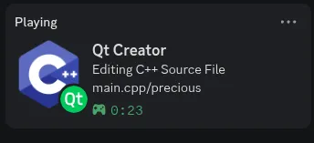

<div align="center">

# Discord RPC Plugin for Qt Creator

Show what you're coding in real-time on your Discord profile.



</div>

---

## Features

- **Live Presence** — Current project and file shown on your Discord profile
- **30+ File Types** — MIME-based detection for C++, Python, QML, Rust, Java, and more
- **Control Menu** — Start/Stop from Qt Creator's Tools menu
- **Session Timer** — Tracks time spent on the current file
- **Per-language Icons** — Different Discord icons for each file type

## Installation

1. Open Qt Creator
2. Go to **Help** > **About Plugins**
3. Click **Install Plugin** and select the downloaded zip
4. Restart Qt Creator

No Discord app setup required — uses a shared Application ID.

<details>
<summary><strong>Building from Source</strong></summary>

### Prerequisites

- Qt Creator 19.0.2 with development files
- Qt 6.11.1 (or compatible Qt 6.x)
- CMake 3.21+
- C++20 compatible compiler (GCC 12+ / Clang 14+)
- [discord-rpc](https://github.com/discord/discord-rpc) library

### Step 1: Build discord-rpc

```bash
git clone https://github.com/discord/discord-rpc.git
cd discord-rpc
mkdir build && cd build

# Fix duplicate key in .clang-format (remove second IndentCaseLabels line)
# Then build with -fPIC for shared library linking
cmake .. -DCMAKE_BUILD_TYPE=Release \
    -DCMAKE_POSITION_INDEPENDENT_CODE=ON \
    -DCMAKE_POLICY_VERSION_MINIMUM=3.5 \
    -DCMAKE_CXX_FLAGS="-Wno-error -fpermissive"

cmake --build . -j$(nproc) --target discord-rpc
cmake --install . --prefix /path/to/discord-rpc-install
```

### Step 2: Build the Plugin

```bash
git clone https://github.com/KorryKatti/qtcreator-plugin-discord-presence.git
cd qtcreator-plugin-discord-presence
mkdir build && cd build

cmake .. -DCMAKE_BUILD_TYPE=Release \
    -DDISCORD_RPC_DIR=/path/to/discord-rpc-install

cmake --build . -j$(nproc)
```

### Step 3: Package and Install

```bash
cd plugins
cp /path/to/DiscordRPCPlugin.json libDiscordRPCPlugin.json
zip DiscordRPCPlugin-<platform>.zip libDiscordRPCPlugin.so libDiscordRPCPlugin.json
```

Then install via **Help** > **About Plugins** > **Install Plugin**.

</details>

## Supported File Types

| Category | Extensions |
|----------|-----------|
| C/C++ | .cpp, .hpp, .cxx, .hxx, .cc, .hh, .c, .h, .i |
| Qt/QMake | .pro, .pri, .ui, .qrc, .qml, .qss |
| Python | .py |
| JavaScript/TypeScript | .js, .ts |
| Web | .html, .css, .scss, .json, .xml |
| Other Languages | .rb, .rs, .lua, .java, .asm, .cs |
| Build | CMakeLists.txt, Makefile, .gitignore |
| Text | .txt, .md |

## Architecture

```
src/
├── discordrpcplugin.h/cpp       # Plugin entry point (IPlugin)
├── discordrpcmanager.h/cpp      # Discord RPC core logic
├── discordrpcconstants.h        # IDs and constants
└── DiscordRPCPlugin.json        # Plugin metadata
```

See [docs/](docs/) for build guides and detailed plugin documentation.

## References

- [Qt Creator Plugin Development](https://doc.qt.io/qtcreator-extending/)
- [Discord RPC Documentation](https://discord.com/developers/docs/activities/rpc)
- [discord-rpc C++ Library](https://github.com/discord/discord-rpc)
- [Cute Discord Presence](https://github.com/eduardoc7/qtcreator-plugin-discord-presence) — Original inspiration
